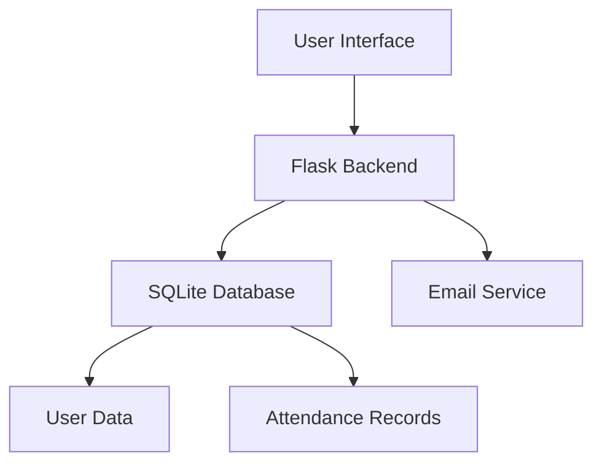

# Attendance Tracker – Documentation

   

A modern web-based attendance management system designed for organizations, schools, and training centers. Ensure accurate attendance recording, prevent fraudulent sign-ins, and simplify reporting.

## 📖 Table of Contents
- [Introduction](#introduction)
- [✨ Key Features](#-key-features)
- [🏗️ System Overview](#-system-overview)
- [🚀 Getting Started](#-getting-started)
  - [Signing Up](#signing-up)
  - [Logging In](#logging-in)
- [📊 Using the System](#-using-the-system)
  - [Marking Attendance](#marking-attendance)
  - [Viewing Reports](#viewing-reports)
  - [Admin Dashboard](#admin-dashboard)
- [👥 Managing Users](#-managing-users)
- [🔔 Notifications](#-notifications)
- [🔒 Security & Privacy](#-security--privacy)
- [❓ Troubleshooting](#-troubleshooting)
- [📞 Contact & Support](#-contact--support)

## 📝 Introduction
Attendance Tracker helps organizations streamline attendance management with real-time tracking, detailed reporting, and secure user authentication. Reduce administrative overhead and improve accountability with our easy-to-use platform.

With Attendance Tracker, you can:
- Track employee or student attendance in real-time
- Generate detailed reports and export data
- Securely manage user profiles and permissions
- Receive notifications for missing sign-ins or anomalies

## ✨ Key Features
| Feature | Description |
|---------|-------------|
| Self-Sign-In | Users can mark their own attendance quickly and easily |
| Admin Dashboard | Comprehensive interface to view, edit, and export records |
| Real-Time Reports | Daily, weekly, and monthly attendance summaries |
| Email Notifications | Alerts for missed check-ins and unusual activity |
| Photo Verification | Optional webcam capture to confirm identity |
| Secure Authentication | Role-based access control and encrypted passwords |
| CSV Export | Download attendance logs for offline analysis |

## 🏗️ System Overview
**Diagram:**

- **Frontend:** Responsive web app compatible with desktop, tablet, and mobile devices
- **Backend:** Flask application handling authentication, database operations, and notifications
- **Database:** SQLite for storing users, attendance logs, and system settings
- **Notifications:** Automated email alerts for events and reminders

## 🚀 Getting Started
### Signing Up
1. Navigate to the Sign Up or Free Trial page
2. Fill in your details:
   - First name
   - Last name
   - Email (valid work email required)
   - Company name
   - Company size
3. Submit the form and check your email for confirmation

### Logging In
1. Visit the login page
2. Enter your registered email and password
3. Click **Sign In** to access your dashboard

💡 **Tip:** Use the Forgot Password link if you need to reset your credentials

## 📊 Using the System
### Marking Attendance
1. Log in to your account
2. Navigate to the Attendance section
3. Click **Sign In** or **Sign Out** as needed
4. Complete photo verification if prompted

### Viewing Reports
For Administrators:
1. Access the Reports section from the dashboard
2. Select a date range and apply filters (user, department, etc.)
3. View summarized data or export as CSV

### Admin Dashboard
The admin dashboard provides:
- **User Management:** Add, edit, or remove users and assign roles
- **Attendance Logs:** Review all recorded entries
- **Notification Center:** View system alerts and missed sign-ins
- **Settings:** Configure system preferences and email templates

## 👥 Managing Users
**Admins can:**
- Create new users with assigned roles (user/admin)
- Reset passwords for existing users
- Deactivate or remove user accounts

**Users can:**
- Update their personal profile information
- Change their password from the dashboard

## 🔔 Notifications
The system sends automated emails for:
- Free trial confirmations and subscription updates
- Missed sign-in alerts
- Unusual activity notifications
- Administrative alerts

All emails include professional branding and signature from the Attendance Tracker team.

## 🔒 Security & Privacy
- **Password Hashing:** All passwords are encrypted and never stored in plain text
- **Role-Based Access Control:** Sensitive actions restricted to admin users only
- **Photo Verification:** Optional identity confirmation to prevent fraud
- **Data Protection:** User information is stored securely and never shared without consent

## ❓ Troubleshooting
| Issue | Solution |
|-------|---------|
| Can't sign in | Verify your email/password or use Forgot Password |
| Email not received | Check spam folder or email filtering rules |
| Photo capture failed | Ensure browser has camera permissions enabled |

For additional support, visit our Support page or contact us directly.

## 📞 Contact & Support
- **Email:** info.attendancetracker@gmail.com
- **Website:** [https://attendance-tracker.com](https://attendances-system-official.onrender.com)
- **Phone:** +220 4010971
- Instagram: [https://www.instagram.com/attendancegm/](https://www.instagram.com/attendancegm/)  
- LinkedIn: [https://www.linkedin.com/company/attendancegm](https://www.linkedin.com/company/attendancegm)  
- X (Twitter): [https://x.com/attendancegm](https://x.com/attendancegm)  
- Facebook: [https://www.facebook.com/attendancegm/](https://www.facebook.com/Attendancegm/)

We typically respond to all inquiries within 24 hours.

---

© 2025 Attendance Tracker. All rights reserved.

