# Attendance Tracker – User & Admin Documentation

## Table of Contents
- [Introduction](#introduction)
- [Key Features](#key-features)
- [System Overview](#system-overview)
- [System Architecture](#system-architecture)
- [Getting Started](#getting-started)
  - [Signing Up](#signing-up)
  - [Logging In](#logging-in)
- [Using the System](#using-the-system)
  - [Marking Attendance](#marking-attendance)
  - [Attendance Reports](#attendance-reports)
  - [Admin Dashboard](#admin-dashboard)
- [Managing Users](#managing-users)
- [Notifications](#notifications)
- [Security & Privacy](#security--privacy)
- [Troubleshooting](#troubleshooting)
- [Contact & Support](#contact--support)

---

## Introduction
Attendance Tracker is a modern web-based attendance management system designed for organizations, schools, and training centers. It ensures accurate attendance recording, prevents fraudulent sign-ins, and simplifies reporting for administrators.

With Attendance Tracker, you can:
- Track employee or student attendance in real-time
- Generate detailed reports
- Securely manage user data
- Receive notifications for missing sign-ins or anomalies

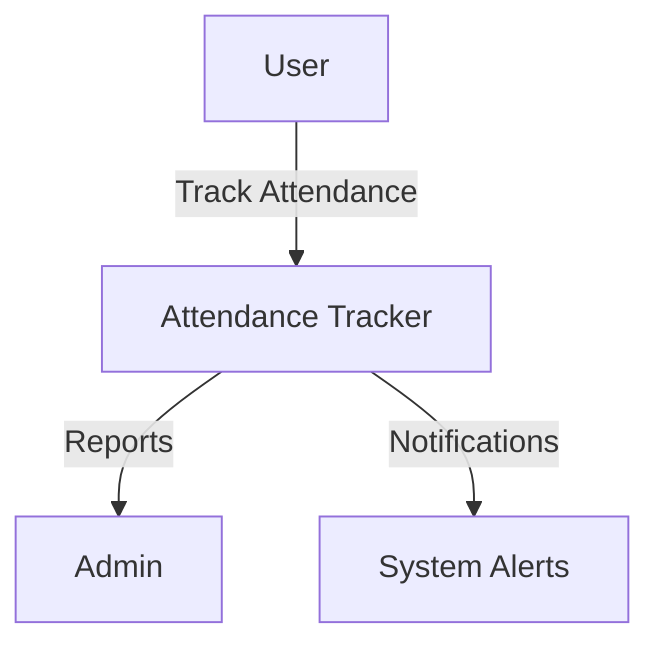

---

## Key Features
- **Self-sign-in for users**: Individuals can mark their own attendance.
- **Admin dashboard**: View, edit, and export attendance records.
- **Real-time reports**: Daily, weekly, and monthly attendance summaries.
- **Notifications**: Email alerts for missed check-ins or unusual activity.
- **Photo verification**: Optional webcam capture to confirm identity.
- **Secure authentication**: Only registered users can sign in.
- **CSV Export**: Download attendance logs for offline analysis.

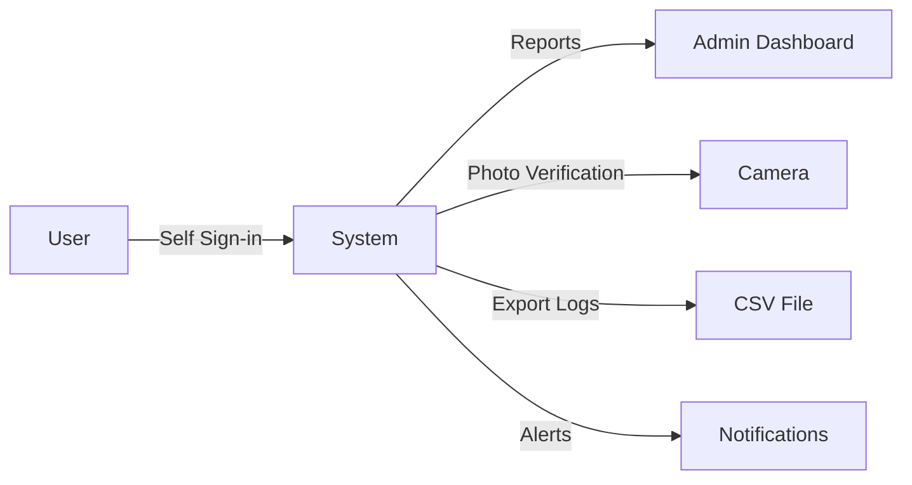

---

## System Overview
Attendance Tracker consists of the following components:
- **User Interface (UI)**: A responsive web app accessible on desktops, tablets, and mobile devices.
- **Backend**: Built with Flask, managing all database interactions, authentication, and email notifications.
- **Database**: SQLite stores users, attendance logs, and configuration settings.
- **Notifications**: Email system to send confirmations, reminders, and alerts.

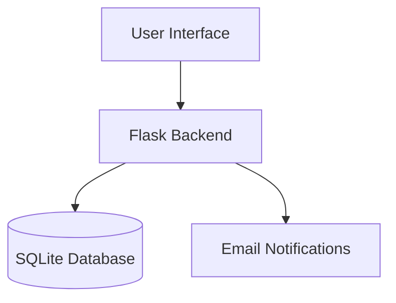

---

## System Architecture
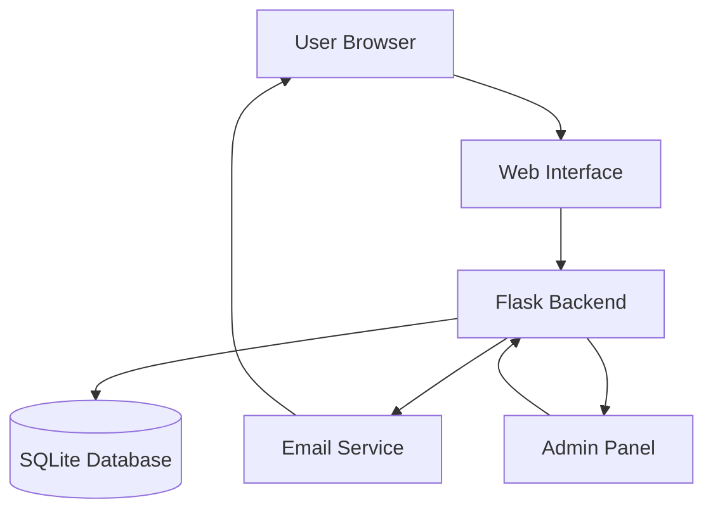

---

## Getting Started

### Signing Up
1. Navigate to the **Free Trial** or **Sign Up** page.
2. Fill in your first name, last name, email, company, and company size.
3. Submit the form. You will receive a confirmation email from the system.

> **Note:** Only valid work emails are accepted for sign-ups.

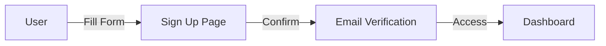

### Logging In
1. Visit the **login page**.
2. Enter your registered email and password.
3. Click **Sign In** to access your dashboard.

> **Tip:** Use the **Forgot Password** link if you cannot remember your password.

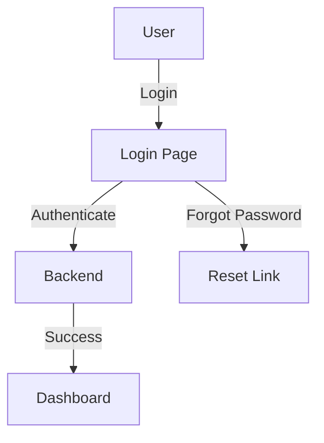

---

## Using the System

### Marking Attendance
1. Log in to the system.
2. Navigate to the **Attendance** page.
3. Click **Sign In** or **Sign Out** as appropriate.
4. If enabled, the system may capture a photo for verification.

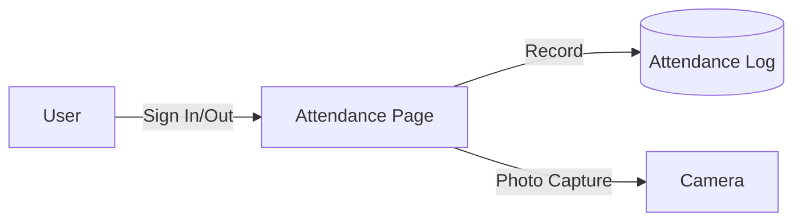

### Attendance Reports
Admins can view reports by:
- Selecting a date range
- Filtering by user or department
- Exporting data as CSV for external analysis

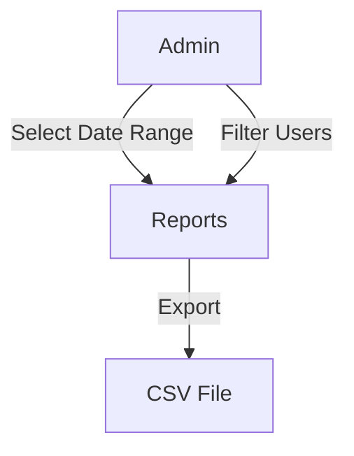

### Admin Dashboard
- **User Management**: Add, edit, or remove users.
- **Attendance Logs**: Review all recorded entries.
- **Notifications**: Check alerts for missed sign-ins.
- **Settings**: Configure system preferences, email templates, and roles.

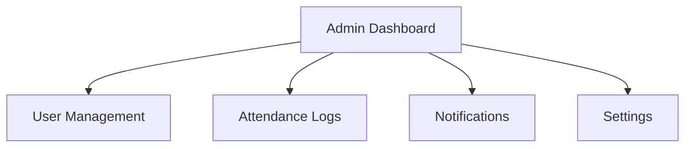

---

## Managing Users

**Admins can:**
- Create new users with roles (user/admin).
- Reset passwords for individuals.
- Deactivate users who no longer need access.

**Users can:**
- Update their profile information.
- Change passwords from the dashboard.

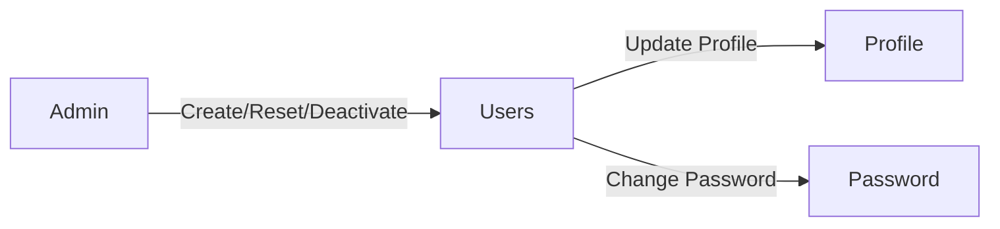

---

## Notifications
Attendance Tracker sends automated emails for:
- Free trial confirmations
- Subscription updates
- Missed sign-in alerts
- Admin notifications for unusual attendance patterns

Emails are professional, branded, and include a clear signature from the Co-founder & CEO, **Musbi Jawo**.

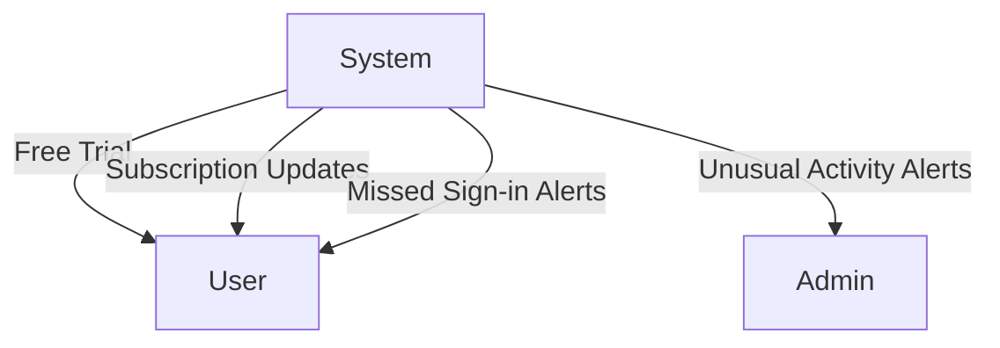

---

## Security & Privacy
- **Password hashing** ensures user passwords are never stored in plain text.
- **Role-based access** limits sensitive actions to admins only.
- **Photo verification** prevents sign-in fraud.
- **Data privacy**: User information is stored securely and never shared without consent.

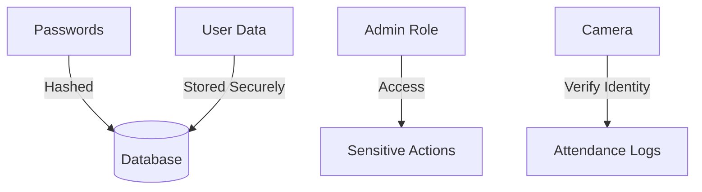

---

## Troubleshooting

**Common issues:**
- **Cannot sign in**: Check your email and password. Use the Forgot Password link if necessary.
- **Email not received**: Ensure your email provider is not blocking emails from `no-reply@attendance-tracker`.
- **Photo capture failed**: Make sure your browser has permission to access the camera.

For additional support, contact our team via the **Support** page.

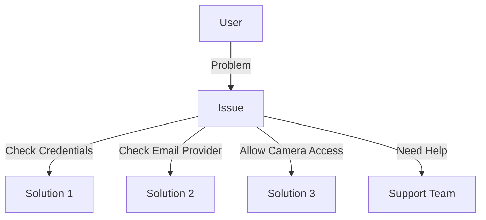

---

## Contact & Support
For help, feature requests, or technical support:

- **Email**: info@attendance.com
- **Website**: [https://www.attendancegm.com/](https://www.attendancegm.com/)
- **Phone**: +220 4010971

You will receive a professional response, usually within 24 hours.

```mermaid
graph TD
    U[User] -->|Email/Call| S[Support Team]
    S -->|Respond in 24h| U
